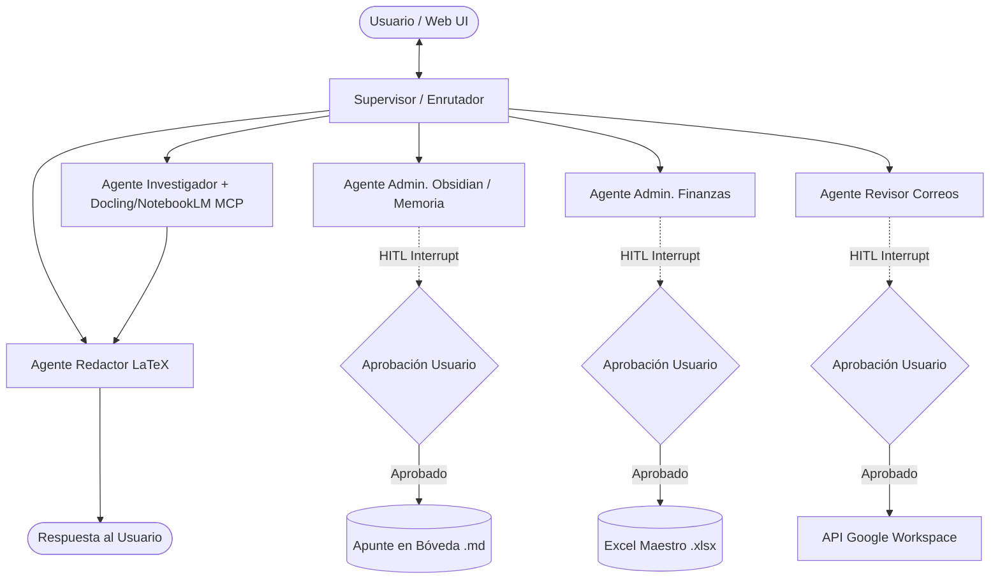

# Especificación de Harness Engineering, MCP de Análisis y Matriz de Autonomía

**Documento de Arquitectura y Gobernanza IA (Actualizado con MCP de Análisis y Bóveda Memoria)**  
**Proyecto:** Asistente Agéntico Edge Distribuido (/AssAntigravity)  
**Autor:** Antigravity (Arquitecto de Software Senior)  
**Revisor:** Director del Proyecto  

---

## 1. Declaración de Principios de Harness Engineering

El **Harness Engineering** (Ingeniería de Contención y Seguridad IA) en la arquitectura de Antigravity establece los límites de autonomía del sistema multiagente que opera sobre la Raspberry Pi 5.

### Reglas Inviolables de Contención:
1. **Lectura y Análisis Autónomo (Principio de Menor Riesgo):** Los agentes tienen permiso total de ejecución autónoma para tareas de solo lectura, búsqueda, consulta semántica en RAG, extracción de información y cómputo aislado.
2. **Interrupción de Estado Mandatoria (Human-In-The-Loop / HITL):** Ningún agente tiene permiso para modificar el estado persistente del usuario (Bóveda de Obsidian, archivos Excel maestros) o comunicarse con el exterior (enviar correos en Google Workspace, agendar eventos en Google Calendar) sin pausar el grafo y obtener aprobación explícita e inequívoca del Director del Proyecto.
3. **Falla Segura Abortiva (Fail-Safe Abort):** Si una herramienta de escritura o modificación recibe parámetros corruptos, alucinaciones o errores de formato, la acción debe abortarse inmediatamente y retornar el control al usuario. **Jamás se debe reintentar automáticamente una acción destructiva.**

---

## 2. Taxonomía Completa del Ecosistema y MCPs Especializados

### A. MCP de Análisis de Documentos (`Docling / NotebookLM MCP`)
Para potenciar la capacidad de análisis del **Agente Investigador**, se integra el **`Docling / NotebookLM MCP`**:
- **Función Principal:** Ingesta y parseo avanzado de documentos complejos (PDFs de múltiples columnas, imágenes con texto, tablas complejas y Markdown).
- **Capacidades:**
  - Extracción de información relevante, entidades clave y relaciones jerárquicas.
  - Generación de resúmenes sintéticos de alto nivel sobre colecciones de documentos.
  - Conversión de PDF/Docx a formato Markdown estructurado de alta fidelidad para RAG.

### B. Redefinición del Propósito Exclusivo de la Bóveda de Obsidian
La Bóveda de Obsidian se constituye como la **Memoria de Investigación y Bitácora de Aprendizaje Continuo** del Asistente Antigravity, sirviendo para dos funciones primordiales:
1. **Para el Asistente:** Almacenar apuntes estructurados, resúmenes de investigaciones profundas solicitadas, registro de fallas del sistema y propuestas de automejora.
2. **Para el Usuario:** Disponer de un registro auditable, organizado e hipervinculado de todas las interacciones relevantes, decisiones y hallazgos.

```
/data/obsidian/
├── 📁 Investigaciones/         # Apuntes y síntesis de investigaciones solicitadas
├── 📁 Sintesis_Interacciones/  # Puntos clave y contexto relevante de conversaciones
├── 📁 Fallas_y_Mejoras/        # Log de autodiagnóstico, errores y propuestas de mejora
└── 📁 Bitacora_Ejecucion/      # Registro auditable de acciones y tareas ejecutadas
```

---

## 3. Taxonomía de Nodos del StateGraph (LangGraph)



---

## 4. Matriz de Autonomía y Permisos

| Agente | Acciones Autónomas (Sin Interrupción) | Acciones Interrumpidas (HITL - Requieren Aprobación) | Puntos de Pausa (LangGraph Node) |
| :--- | :--- | :--- | :--- |
| **Investigador** | • Buscar en Web y arXiv.<br>• Consultar RAG (Qdrant/PDFs).<br>• Ejecutar análisis con **Docling / NotebookLM MCP**.<br>• Ejecutar sandbox de cálculo en Jupyter. | *Ninguna.* (Modo lectura, extracción y cómputo analítico puro). | N/A |
| **Redactor** | • Formatear textos y generar sintaxis LaTeX.<br>• Compilar archivos `.tex` temporales.<br>• Generar vistas previas de respuestas. | *Ninguna.* (Genera únicamente borradores en memoria y caché). | N/A |
| **Admin. Obsidian (Memoria)** | • Leer notas de la bóveda de memoria (`.md`).<br>• Consultar aprendizajes y hallazgos pasados.<br>• Mapear relaciones entre investigaciones. | • **Crear nuevos apuntes de investigación `.md` en la bóveda.**<br>• **Registrar hallazgos, fallas o mejoras en disco.**<br>• **Modificar o eliminar notas existentes en la bóveda.** | `interrupt_before=["obsidian_writer_node"]` |
| **Admin. Finanzas** | • Leer hojas de cálculo (`.xlsx`/`.csv`).<br>• Realizar cálculos estadísticos en memoria.<br>• Generar gráficos y resúmenes ejecutivos. | • **Sobrescribir archivos Excel maestros.**<br>• **Exportar o guardar nuevos reportes financieros en disco.**<br>• **Emitir alertas de saldo hacia servicios externos.** | `interrupt_before=["finance_writer_node"]` |
| **Revisor Correos** | • Leer la bandeja de entrada de Gmail.<br>• Categorizar y resumir correos recibidos.<br>• Generar borradores de correo (*drafts*). | • **Enviar correos electrónicos a destinatarios.**<br>• **Eliminar o archivar correos de la bandeja.**<br>• **Crear o modificar eventos en Google Calendar.** | `interrupt_before=["email_action_node"]` |

---

## 5. Estructura del Estado Global (`AgentState`) para Human-In-The-Loop

```python
class PendingAction(TypedDict):
    action_id: str             # UUID único de la acción propuesta
    agent_name: str            # Agente solicitante (ej. 'obsidian_agent', 'email_agent')
    tool_name: str             # Herramienta a ejecutar (ej. 'create_obsidian_note', 'send_gmail')
    description: str           # Resumen ejecutivo para el usuario
    payload: Dict[str, Any]    # Parámetros exactos (ej. {filename: "Investigacion_IA.md", content: "..."})
    risk_level: str            # "MEDIUM" (escritura local de apunte) | "HIGH" (envío externo / borrado)

class AgentState(TypedDict):
    # Campos base conversacionales
    user_query: str
    thread_id: str
    agent_history: List[str]
    current_agent: str
    active_tier: str
    active_model: str
    
    # Contextos acumulados de herramientas
    research_context: Optional[str]   # Incluye hallazgos del Docling / NotebookLM MCP
    obsidian_context: Optional[str]   # Contexto de memoria de notas anteriores
    finance_context: Optional[str]
    email_context: Optional[str]
    
    # CAMPOS DE HARNESS ENGINEERING & HITL
    pending_action: Optional[PendingAction]  # Acción crítica propuesta en espera
    user_approval_status: Optional[str]      # "PENDING" | "APPROVED" | "REJECTED"
    user_approval_feedback: Optional[str]    # Opcional: Instrucciones de corrección
    
    # Respuesta final
    final_response: Optional[str]
    latency_ms: float
```

---

## 6. Arquitectura del Flujo HITL en LangGraph

```python
# Definición de compilación del StateGraph con Checkpointer de Memoria e Interrupciones
app_graph = workflow.compile(
    checkpointer=memory_checkpointer,
    interrupt_before=[
        "obsidian_writer_node",
        "finance_writer_node",
        "email_action_node"
    ]
)
```

### Ciclo de Vida de Guardado de Apunte en Obsidian:

```
[1. Usuario solicita: "Investiga sobre arquitecturas RAG híbridas y guarda un apunte en Obsidian"]
                                      │
                                      ▼
[2. Agente Investigador procesa documentos con Docling / NotebookLM MCP y extrae síntesis]
                                      │
                                      ▼
[3. Agente Obsidian propone guardar apunte en '/obsidian/Investigaciones/RAG_Hibrido.md']
                                      │
                                      ▼
[4. LangGraph llega a 'obsidian_writer_node' -> PUNTO DE INTERRUPCIÓN DISPARADO]
                                      │
                                      ▼
[5. El Estado se guarda en SQLite Checkpointer y la ejecución se PAUSA]
                                      │
                                      ▼
[6. Web UI despliega Modal: "¿Autorizas guardar el apunte de investigación en Obsidian?"]
         │                                       │
         ├─── (Usuario clica APROBAR) ───────────┼─── (Usuario clica RECHAZAR)
         │                                       │
         ▼                                       ▼
[7a. REST API: /api/chat/approve-action]   [7b. REST API: /api/chat/reject-action]
         │                                       │
         ▼                                       ▼
[8a. Se crea RAG_Hibrido.md en Bóveda]     [8b. Se cancela guardado en disco]
```

---

## 7. Políticas de Fallas Seguras (Fail-Safe Protocol)

1. **Sin Autoejecución Retrospectiva:** Si el guardado de un apunte o envío de correo es rechazado, el agente notifica de forma transparente: *"El apunte fue presentado en pantalla pero no se guardó en la bóveda de Obsidian a petición del usuario."*
2. **Validación de Estructura de Apunte:** Las notas creadas en Obsidian siguen una plantilla YAML estandarizada (`tags`, `fecha`, `categoria`, `resumen`).
3. **Persistencia Transaccional:** Todas las decisiones de aprobación o rechazo quedan registradas en `/app/dbs/audit_log.json` para auditoría de gobernanza del sistema.
