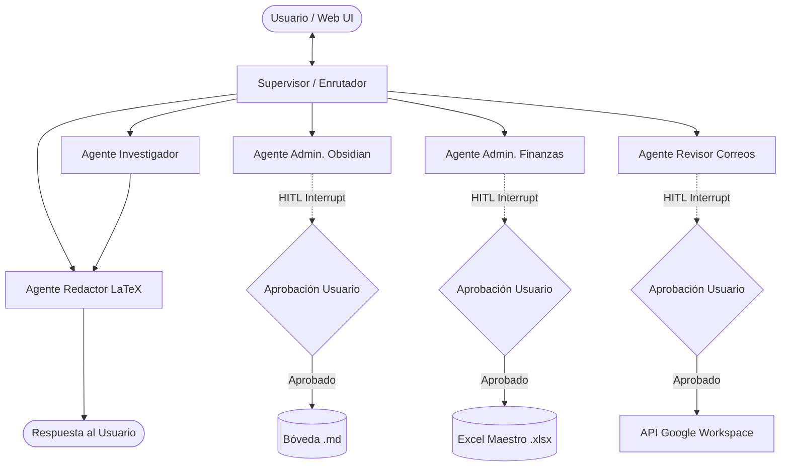

# Especificación de Harness Engineering y Matriz de Autonomía (Sistema Multiagente Edge)

**Documento de Arquitectura y Gobernanza IA**  
**Proyecto:** Asistente Agéntico Edge Distribuido (/AssAntigravity)  
**Autor:** Antigravity (Arquitecto de Software Senior)  
**Revisor:** Director del Proyecto  

---

## 1. Declaración de Principios de Harness Engineering

El **Harness Engineering** (Ingeniería de Contención y Seguridad IA) en la arquitectura de Antigravity establece los límites de autonomía del sistema multiagente que opera sobre la Raspberry Pi 5.

### Reglas Inviolables de Contención:
1. **Lectura y Análisis Autónomo (Principio de Menor Riesgo):** Los agentes tienen permiso total de ejecución autónoma para tareas de solo lectura, búsqueda, consulta semántica en RAG, extracción de información y cómputo aislado.
2. **Interrupción de Estado Mandatoria (Human-In-The-Loop / HITL):** Ningún agente tiene permiso para modificar el estado persistente del usuario (Bóveda de Obsidian, archivos Excel maestros) o comunicarse con el exterior (enviar correos en Google Workspace, agendar eventos en Google Calendar) sin pausar el grafo y obtener aprobación explícita e inequívoca del Director del Proyecto.
3. **Falla Segura Abortiva (Fail-Safe Abort):** Si una herramienta de escritura o modificación recibe parámetros corruptos, alucinaciones o errores de formato, la acción debe abortarse inmediatamente y retornar el control al usuario. **Jamás se debe reintentar automáticamente una acción destructiva.**

---

## 2. Taxonomía Completa del Ecosistema

### A. Agentes (Nodos del StateGraph de LangGraph)



1. **Supervisor (Enrutador Central):** Evalúa la intención de la consulta, selecciona el agente especialista adecuado y administra la cascada de failover LLM (`qwen3.5:4b` $\rightarrow$ Gemini $\rightarrow$ `qwen2.5:1.5b`).
2. **Investigador:** Experto en análisis del estado del arte, búsqueda web/arXiv y consultas semánticas RAG. Operación 100% autónoma.
3. **Redactor:** Especialista en estructuración de documentos y sintaxis LaTeX pura. Generación de borradores y visualización 100% autónoma.
4. **Administrador de Obsidian:** Gestor de conocimiento personal. Operación autónoma en mapeo y lectura; **interrumpida en escritura/modificación/eliminación de notas `.md`**.
5. **Administrador de Finanzas:** Analista cuantitativo. Operación autónoma en lectura de planillas `.xlsx` y gráficos en memoria; **interrumpida al sobrescribir archivos maestros o exportar balances**.
6. **Revisor de Correos:** Gestor de comunicaciones. Operación autónoma al leer y generar borradores (*drafts*); **interrumpida al enviar/eliminar correos o agendar eventos en Google Calendar**.

---

## 3. Matriz de Autonomía y Permisos

| Agente | Acciones Autónomas (Sin Interrupción) | Acciones Interrumpidas (HITL - Requieren Aprobación) | Puntos de Pausa (LangGraph Node) |
| :--- | :--- | :--- | :--- |
| **Investigador** | • Buscar en Web y arXiv.<br>• Consultar RAG (Qdrant/PDFs).<br>• Ejecutar sandbox de cálculo en Jupyter. | *Ninguna.* (Modo lectura y cómputo analítico puro). | N/A |
| **Redactor** | • Formatear textos y generar sintaxis LaTeX.<br>• Compilar archivos `.tex` temporales.<br>• Generar vistas previas de respuestas. | *Ninguna.* (Genera únicamente borradores en memoria y caché). | N/A |
| **Admin. Obsidian** | • Leer notas de la bóveda (`.md`).<br>• Mapear grafo de enlaces bidireccionales.<br>• Analizar etiquetas y metadatos YAML. | • **Crear nuevas notas `.md` en la bóveda real.**<br>• **Modificar o sobreescribir notas existentes.**<br>• **Eliminar o renombrar archivos de la bóveda.** | `interrupt_before=["obsidian_writer_node"]` |
| **Admin. Finanzas** | • Leer hojas de cálculo (`.xlsx`/`.csv`).<br>• Realizar cálculos estadísticos en memoria.<br>• Generar gráficos y resúmenes ejecutivos. | • **Sobrescribir archivos Excel maestros.**<br>• **Exportar o guardar nuevos reportes financieros en disco.**<br>• **Emitir alertas de saldo hacia servicios externos.** | `interrupt_before=["finance_writer_node"]` |
| **Revisor Correos** | • Leer la bandeja de entrada de Gmail.<br>• Categorizar y resumir correos recibidos.<br>• Generar borradores de correo (*drafts*). | • **Enviar correos electrónicos a destinatarios.**<br>• **Eliminar o archivar correos de la bandeja.**<br>• **Crear o modificar eventos en Google Calendar.** | `interrupt_before=["email_action_node"]` |

---

## 4. Estructura del Estado Global (`AgentState`) para Human-In-The-Loop

Para dar soporte a las pausas e interrupciones de estado en LangGraph, el esquema del `AgentState` se extenderá con los atributos de contención:

```python
class PendingAction(TypedDict):
    action_id: str             # UUID único de la acción propuesta
    agent_name: str            # Agente solicitante (ej. 'obsidian_agent', 'email_agent')
    tool_name: str             # Herramienta a ejecutar (ej. 'create_obsidian_note', 'send_gmail')
    description: str           # Resumen ejecutivo para el usuario
    payload: Dict[str, Any]    # Parámetros exactos (ej. {filename: "Nota.md", content: "..."})
    risk_level: str            # "MEDIUM" (escritura local) | "HIGH" (envío externo / borrado)

class AgentState(TypedDict):
    # Campos base conversacionales
    user_query: str
    thread_id: str
    agent_history: List[str]
    current_agent: str
    active_tier: str
    active_model: str
    
    # Contextos acumulados de herramientas
    research_context: Optional[str]
    obsidian_context: Optional[str]
    finance_context: Optional[str]
    email_context: Optional[str]
    
    # CAMPOS DE HARNESS ENGINEERING & HITL
    pending_action: Optional[PendingAction]  # Acción crítica propuesta en espera
    user_approval_status: Optional[str]      # "PENDING" | "APPROVED" | "REJECTED"
    user_approval_feedback: Optional[str]    # Opcional: Instrucciones de corrección
    
    # Respuesta final
    final_response: Optional[str]
    latency_ms: float
```

---

## 5. Arquitectura del Flujo HITL en LangGraph

### Mecanismo de Pausa e Interrupción (`interrupt_before`)

En la compilación del grafo, los nodos de escritura destructiva se aíslan mediante **`interrupt_before`**:

```python
# Definición conceptual de la compilación del StateGraph con Checkpointer de Memoria
app_graph = workflow.compile(
    checkpointer=memory_checkpointer,
    interrupt_before=[
        "obsidian_writer_node",
        "finance_writer_node",
        "email_action_node"
    ]
)
```

### Ciclo de Vida de una Acción Interrumpida:

```
[1. Usuario solicita: "Envía un correo a Juan confirmando la reunión de mañana"]
                              │
                              ▼
[2. Agente Revisor Correos genera propuesta de borrador en 'pending_action']
                              │
                              ▼
[3. LangGraph llega a 'email_action_node' -> PUNTOS DE INTERRUPCIÓN DISPARADO]
                              │
                              ▼
[4. El Estado se guarda en SQLite Checkpointer y la ejecución se PAUSA]
                              │
                              ▼
[5. Backend FastAPI emite estado 'PENDING_APPROVAL' hacia la Web UI]
                              │
                              ▼
[6. Web UI despliega Modal de Confirmación de Acción Crítica]
         │                                       │
         ├─── (Usuario clica APROBAR) ───────────┼─── (Usuario clica RECHAZAR)
         │                                       │
         ▼                                       ▼
[7a. REST API: /api/chat/approve-action]   [7b. REST API: /api/chat/reject-action]
         │                                       │
         ▼                                       ▼
[8a. LangGraph reanuda con APROBADO]       [8b. LangGraph reanuda con RECHAZADO]
         │                                       │
         ▼                                       ▼
[9a. 'email_action_node' envía correo]    [9b. Acción cancelada. Redactor notifica]
```

---

## 6. Protocolo de Comunicación con la Web UI (Modal de Confirmación)

Cuando `pending_action` no es nulo y la ejecución se encuentra en estado de pausa, el endpoint `/api/chat` o la transmisión WebSocket entregará una respuesta especial:

### Payload de Notificación entregado al Frontend:
```json
{
  "status": "AWAITING_USER_APPROVAL",
  "thread_id": "thread_main_user",
  "pending_action": {
    "action_id": "act-984214",
    "agent_name": "Revisor de Correos",
    "tool_name": "gmail_send_email",
    "description": "El agente solicita autorización para enviar un correo electrónico.",
    "risk_level": "HIGH",
    "payload": {
      "to": "juan@empresa.com",
      "subject": "Confirmación de Reunión",
      "body": "Hola Juan, confirmo nuestra reunión para mañana a las 10:00 AM."
    }
  }
}
```

### Comportamiento del Modal en la Interfaz Web:
1. Muestra un recuadro de alerta con borde amarillo/rojo indicando **"⚠️ Aprobación Requerida para Acción Crítica"**.
2. Desglosa los parámetros exactos (Destinatario, Asunto, Cuerpo, Archivo a modificar o Diff).
3. Ofrece 2 opciones claras:
   - **🟢 Aprobar y Ejecutar Acción:** Envía `POST /api/chat/approve-action` con `{ action_id: "act-984214" }` y reanuda el grafo.
   - **🔴 Cancelar Acción:** Envía `POST /api/chat/reject-action` con feedback opcional, abortando la ejecución sin alterar archivos ni enviar correos.

---

## 7. Políticas de Fallas Seguras (Fail-Safe Protocol)

1. **Sin Autoejecución Retrospectiva:** Si una acción es rechazada por el usuario, el grafo registra el rechazo en el historial del agente y pasa el control al Redactor para notificar: *"La acción de enviar correo a Juan fue cancelada a petición del usuario."*
2. **Validación de Firma de Herramienta (Tool Payload Schema):** Antes de pausar para aprobación, el argumento de la herramienta es validado con Pydantic. Si los argumentos fallan la validación, la acción se descarta inmediatamente sin molestar al usuario con modales de aprobación sobre cargas corruptas.
3. **Persistencia Transaccional:** Todas las decisiones de aprobación o rechazo quedan registradas en `/app/dbs/audit_log.json` para auditoría de gobernanza del sistema.

---

### Confirmación de Antigravity (Arquitecto de Software)
He comprendido en su totalidad la **Taxonomía** y los requisitos de **Harness Engineering**. Quedo a la espera de la revisión y aprobación de este documento especificación (`harness_spec.md`) por parte del **Director del Proyecto** para proceder con su implementación en el código fuente.
